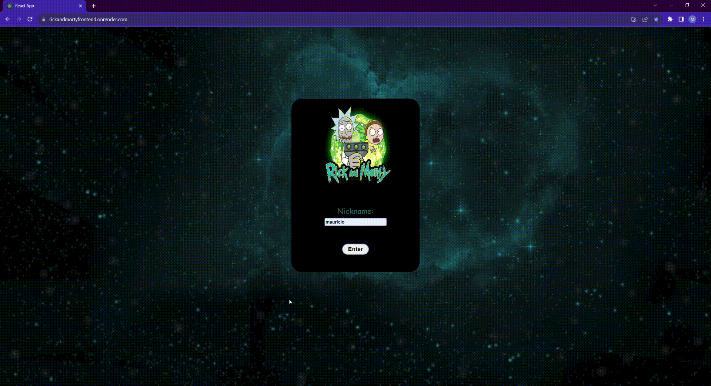

# Rick & Morty App
An app application that features Rick & Morty animated series characters. The app's back end and front end manage and render the character data that was collected from a public Api.

# Features
- Favorites
- Search
- Filtering and ordering of data
- CRUD operations
- REST API requests


## Stack

**Client:** React, Redux, CSS Modules

**Server:** JavaScript, Node JS, Express


## Screenshots

**Login**



**Search Characters**


**Favorites**


**Detail**


**Tablet Responsive**


**Phone Responsive**


## Installation

1.- Clone the repo.

```bash
  git clone https://github.com/MauricioAlonso28/RICKANDMORTY.git
```

2.- From the main folder, move to "client" directory and install dependencies.

```bash
  cd client
  npm install
```

3.- From the main folder, move to "server" directory and install dependencies.

```bash
  cd server
  npm install
```
4.- Run npm start in the terminal, located at the "server" directory. Next, run the same command again this time located in the "client" directory.

```bash
    npm start
```
